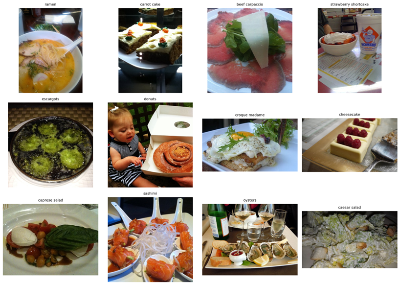
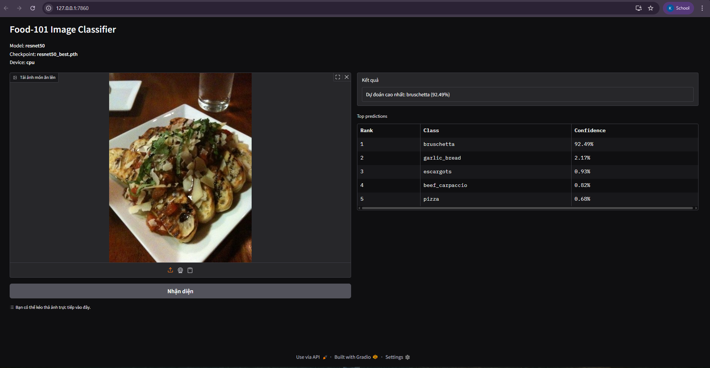
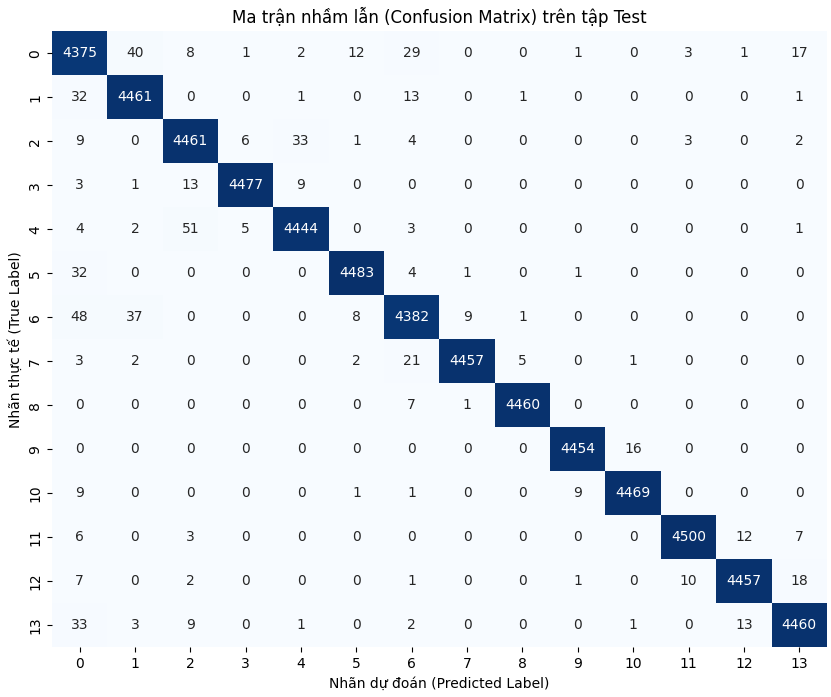
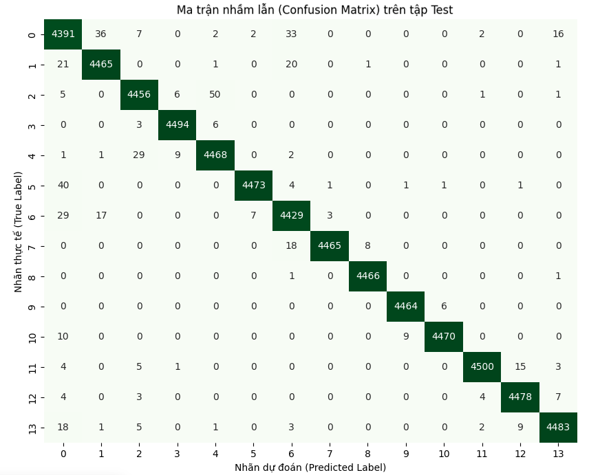
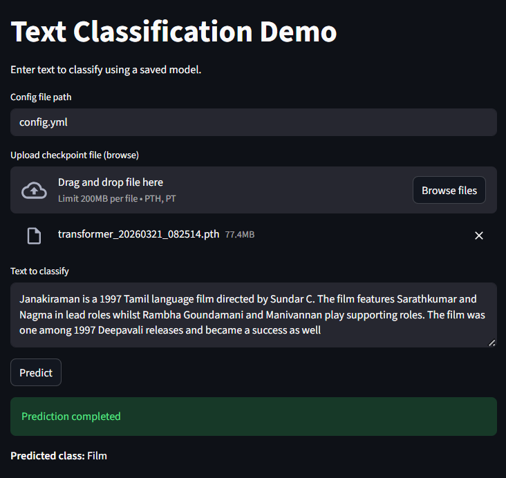
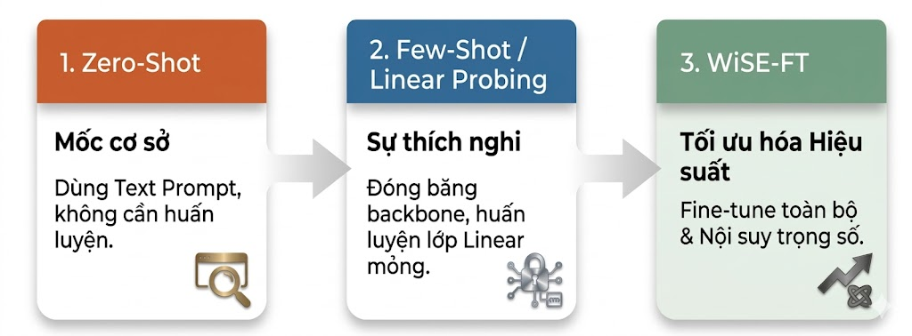
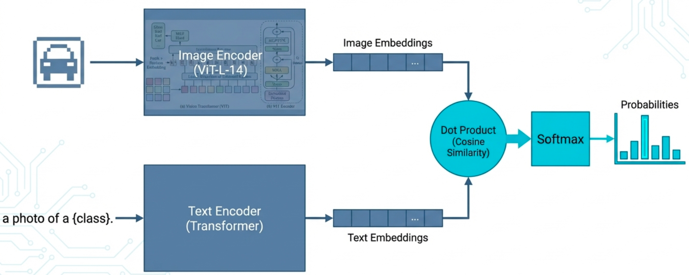

# Assignment 1 - Deep Learning for Computer Vision

## Team Information

**Group13**

- Lê Đức Phương - 2570480
- Nguyễn Đình Khánh - 2570227
- Nguyễn Huy Hoàng - 2570089
- Nguyễn Huỳnh Như - 2570471

**Supervisor:** Dr. Lê Thành Sách

---

## Project Resources

- Demo video: to be updated
- Presentation video (YouTube): to be updated
- Report PDF: [assignment_1/report.pdf](assignment_1/report.pdf)
- Landing Page: [index.html](../index.html)

The source code is organized into 3 independent parts:

- Image Classification: `images-classification/food101_project/`
- Emotion/Text Classification: `text-classification/`
- Multimodal Classification: `multi-modal-classification/`

---

## 1) Image Classification

### 1.1 Problem Statement and EDA

- Task: multi-class food image classification (101 classes).
- Dataset: Food-101.
- Goal: compare two approaches, CNN and Transformer.

Detailed documentation and source code:

- `images-classification/food101_project/README.md`

Dataset reference:

- Food-101 (Kaggle): <https://www.kaggle.com/datasets/dansbecker/food-101>

EDA is implemented in the script:

- `images-classification/food101_project/eda.py`

EDA outputs include class count statistics, data distribution, image size analysis, and sample images.

### 1.4 Visual Results

**Food-101 Dataset Overview**



**Image Classification Demo**



### 1.2 Data Preparation and Augmentation

- Data pipeline is implemented in `dataset.py`.
- Preprocessing resizes images to a standard size of 224 x 224.
- Normalization follows ImageNet statistics for pretrained backbones.
- Augmentation is applied to the training set (random crop/flip and basic augmentation techniques).

### 1.3 Training and Model Comparison

Main models:

- ResNet50 (CNN).
- ViT-B/16 (Vision Transformer).

Experiment settings:

- Baseline fine-tuning.
- Freeze backbone vs full fine-tuning.
- No-augmentation ablation.
- Error analysis.
- Grad-CAM (for CNN).

Evaluation metrics:

- Accuracy, Macro-F1, Precision, Recall.
- Confusion matrix, classification report, top confusions.

Example commands:

```bash
cd images-classification/food101_project
pip install -r requirements.txt
python eda.py
python train.py --models resnet50 vit_b_16 --epochs 8 --batch_size 16 --run_name baseline
python run_experiments.py --models resnet50 vit_b_16 --epochs 8 --batch_size 16
```

---

## 2) Text Classification

### 2.1 Dataset

This part uses a multi-class text classification task with the DBpedia-14 dataset.

Dataset:

- <https://huggingface.co/datasets/fancyzhx/dbpedia_14>

Source code and instructions:

- `text-classification/README.md`

### 2.2 Preprocessing and Data Pipeline

- Normalize text, tokenize, and build vocabulary.
- Create DataLoader with padding/collate.
- Centralized configuration in `config.yml`.

Main components:

- `text-classification/src/train.py`
- `text-classification/src/predict.py`
- `text-classification/src/models/rnn.py`
- `text-classification/src/models/transformer.py`
- `text-classification/src/utils/`

### 2.3 Training and Model Comparison

Compared models:

- RNN
- Transformer

Example commands:

```bash
cd text-classification
pip install -r requirements.txt
python -m src.train --config_file config.yml
python -m src.predict --config_file config.yml --input_text "This is a test sentence"
```

Streamlit demo UI is also supported:

```bash
cd text-classification
streamlit run streamlit_app.py
```

### 2.4 Visual Results

**RNN Confusion Matrix**



**Transformer Confusion Matrix**



**Text Classification Demo**



---

## 3) Multimodal Approach

### 3.1 Dataset

This part uses CIFAR-100 for multimodal approaches based on OpenCLIP.

Dataset:

- <https://huggingface.co/datasets/cifar100>

Detailed documentation:

- `multi-modal-classification/README.md`

### 3.2 Data Augmentation and Preprocessing

- Extract image features from the OpenCLIP image encoder.
- Build a text classifier using prompt templates for zero-shot inference.
- Sample few-shot data based on the number of examples per class.
- Standardize evaluation with accuracy/F1/precision/recall.

### 3.3 Zero-shot Classification Approach

- No training on target labeled data is required.
- Use image embeddings and text embeddings to infer labels directly.

Main script:

- `multi-modal-classification/zero_shot.py`

### 3.4 Few-shot Classification Approach

- Freeze the CLIP backbone.
- Train a linear classifier using a small number of samples per class (k-shot).
- Compare performance across multiple k values (for example: 4, 8, 16, 32, 50, 80).

Main script:

- `multi-modal-classification/few_shot.py`

### 3.5 WiSE-FT (Extension)

- Fine-tune the model and interpolate weights between the zero-shot model and the fine-tuned model.
- Improve generalization and reduce overfitting when labeled data is limited.

Main script:

- `multi-modal-classification/wise_ft.py`

Example commands:

```bash
cd multi-modal-classification
pip install -r requirements.txt
python run_all.py --mode zero_shot
python run_all.py --mode few_shot
python run_all.py --mode wise_ft
```

### 3.6 Visual Results

**OpenCLIP Pipeline**




---

## 4) Summary

This assignment is implemented in three branches, corresponding to three problem groups:

- Image: CNN vs ViT on Food-101, including EDA, augmentation, and interpretability.
- Text: RNN vs Transformer on DBpedia-14, including training/inference/UI demo.
- Multimodal: Zero-shot, Few-shot, and WiSE-FT with OpenCLIP on CIFAR-100.

Each branch has its own README with detailed run instructions, source code structure, and outputs.
