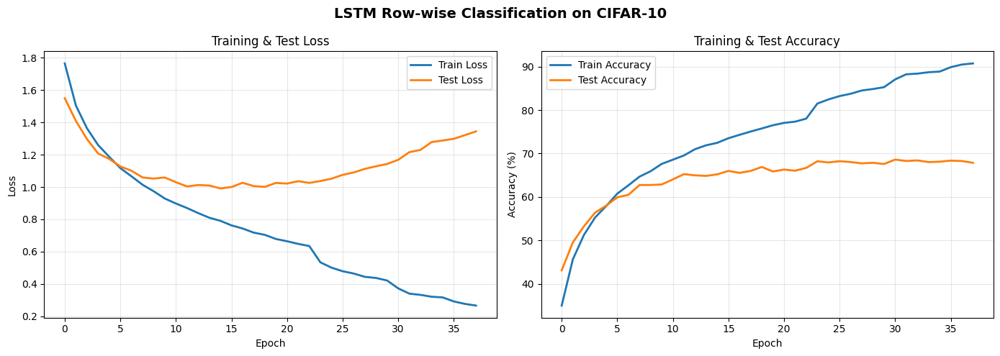
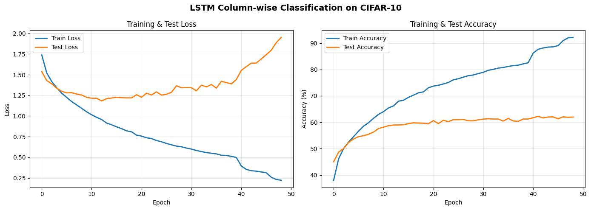
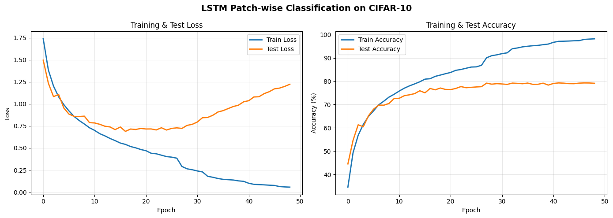

# Exercise: CIFAR-10 Deep Learning Portfolio (Part 1 -> Part 5)

## Team Information

**Group13**

- Lê Đức Phương - 2570480
- Nguyễn Đình Khánh - 2570227
- Nguyễn Huy Hoàng - 2570089
- Nguyễn Huỳnh Như - 2570471

**Supervisor:** Dr. Lê Thành Sách

## 1. Executive Summary

The scope includes three major blocks:

- `part-1-2-3`: Baseline models and a custom Vision Transformer implementation.
- `part-4/cifar10_part34_project`: Diverse architecture directions (ViT patch, ViT overlap, CNN-Transformer hybrid).
- `part-5`: CIFAR-10 sequence modeling with LSTM/GRU and multiple sequence representations.

Main report goals:

- Demonstrate correct model implementation and training loops.
- Compare architecture families using scientific reporting artifacts (metrics, curves, confusion matrices, attention).
- Cover all grading criteria from Part 1 to Part 5.

## 2. Dataset and Preprocessing

### Dataset

- CIFAR-10
- 60,000 RGB images of size 32x32
- 10 classes
- Standard split: 50,000 training / 10,000 test

### Preprocessing and augmentation (combined view)

- CIFAR-10 normalization:
  - mean = (0.4914, 0.4822, 0.4465)
  - std = (0.2470, 0.2435, 0.2616)
- Augmentation used across parts:
  - RandomHorizontalFlip
  - RandomCrop(32, padding=4) (especially in Part 4)

#### Data distribution (example images)


## 3. Repository Layout

```text
excercise/
├── README.md
├── part-1-2-3/
│   ├── README.md
│   ├── config.json
│   ├── dataset.py
│   ├── models.py
│   ├── custom_vit.py
│   ├── train.py
│   ├── utils.py
│   └── main.py
├── part-4/
│   └── cifar10_part34_project/
│       ├── README.md
│       ├── configs/
│       │   ├── vit_patch.json
│       │   ├── vit_overlap.json
│       │   └── cnn_transformer.json
│       ├── src/
│       │   ├── data.py
│       │   ├── engine.py
│       │   ├── utils.py
│       │   └── models/
│       │       ├── common.py
│       │       ├── vit_patch.py
│       │       ├── vit_overlap.py
│       │       └── cnn_transformer.py
│       ├── train.py
│       ├── evaluate.py
│       ├── plot_results.py
│       ├── requirements.txt
│       └── report_outline.md
└── part-5/
    ├── README.md
    ├── out.json
    ├── notebooks/
    └── report/
```

## 4. Reproducibility Instructions

### Environment

- Python >= 3.8
- PyTorch (CUDA recommended if available)
- torchvision
- NumPy, Matplotlib, Seaborn, Pandas, Scikit-learn

### Quick setup

Part 1-2-3:

```bash
cd excercise/part-1-2-3
conda activate HCMUT
pip install -r requirements.txt
```

Part 4:

```bash
cd excercise/part-4/cifar10_part34_project
pip install -r requirements.txt
```

Part 5:

- Run notebooks in `excercise/part-5/notebooks/`.
- If you script any step, use the same PyTorch/torchvision environment.

### Execution steps by part

Part 1-2-3:

```bash
cd excercise/part-1-2-3
python main.py
```

Part 4:

```bash
cd excercise/part-4/cifar10_part34_project

python train.py --config configs/vit_patch.json
python train.py --config configs/vit_overlap.json
python train.py --config configs/cnn_transformer.json

python evaluate.py --checkpoint results/vit_patch/best.pt --config configs/vit_patch.json
python plot_results.py --runs results/vit_patch results/vit_overlap results/cnn_transformer
```

Part 5:

1. Open `excercise/part-5/notebooks/gru-cifar10-patch-sequence.ipynb` for an end-to-end run.
2. Run LSTM row/column/patch notebooks for representation comparison.
3. Export loss/accuracy plots, confusion matrices, and attention maps to `excercise/part-5/report/images/`.

## 5. Methodological Summary

### 5.1 Part 1-2-3: Baselines -> Custom ViT

#### Models implemented

1. Softmax Regression
2. MLP
3. CNN (3 convolution blocks + BatchNorm + MaxPool + classifier)
4. ViT (PyTorch TransformerEncoder)
5. ViT (Custom): implemented with `CustomMultiHeadAttention` and `CustomTransformerEncoderBlock`

#### Training pipeline

- Custom training loop in `train.py`:
  - forward
  - loss computation
  - backward
  - optimizer step
- Early stopping based on test accuracy.
- Model toggles and hyperparameters controlled via `config.json`.

#### Outputs

- `result/results.json`: epoch-wise metrics + total training time + final metrics.
- `images/*.png`: training/testing loss and testing accuracy plots.

### 5.2 Part 4: Hybrid Architectures and Embedding Strategies

#### Architecture directions

1. ViT-Patch
  - Non-overlapping patch tokenization
  - Linear patch embedding
  - `[CLS]` token + positional embedding
2. ViT-Overlap
  - Conv2d tokenizer (kernel size > stride)
  - Overlapping tokens
3. CNN-Transformer Hybrid
  - CNN local feature extraction
  - Flatten spatial features into a token sequence
  - Transformer models global token interactions

#### Recommended experimental setup

- Optimizer: Adam
- Learning rate: 1e-3
- Batch size: 128
- Epochs: 20-30
- Loss: CrossEntropyLoss
- Augmentation: RandomCrop + RandomHorizontalFlip + Normalize

#### Evaluation artifacts

- Train/validation loss curves
- Train/validation accuracy curves
- Training time per epoch

### 5.3 Part 5: LSTM/GRU Sequence Modeling

#### Sequence conversion strategies

- Row-wise: T=32, D=96
- Column-wise: T=32, D=96
- Patch-wise (4x4 non-overlap): T=64, D=48


#### Model topology

- 2-layer Bi-directional LSTM/GRU
- Attention mechanism
- Final classification head (10 classes)
- Loss: CrossEntropy
- Optimizer: Adam
- Scheduler: ReduceLROnPlateau (validation accuracy)
- Best-checkpoint strategy by validation accuracy

#### Recommended hyperparameters

- batch_size = 128
- epochs = 50
- learning_rate = 0.001
- weight_decay = 1e-4
- num_workers = 2
- hidden_size = 128
- num_layers = 2
- bidirectional = True
- dropout = 0.3
- early stopping patience = 7

#### Results

##### Part 5 quantitative table (from report)

| Model | Representation | Accuracy | Parameter Count | Epoch Time |
| ----- | -------------- | -------- | --------------- | ---------- |
| LSTM  | Column-wise    | 62.23%   | 694,603         | ~15.2s     |
| LSTM  | Row-wise       | 68.60%   | 694,603         | ~15.5s     |
| LSTM  | Patch-wise     | 79.28%   | 741,899         | ~16.8s     |
| GRU   | Patch-wise     | 79.87%   | 511,883         | ~11.9s     |

Observations:

- Patch-wise representation significantly outperforms row-wise and column-wise variants.
- Patch-wise GRU gives the best accuracy while also being lighter than patch-wise LSTM.

##### Visualization assets

Part 5 includes complete visual reporting:

- CIFAR-10 sample images
- Sequence conversion diagrams
- Learning curves
- Confusion matrices
- Attention heatmaps

All assets are stored in `excercise/part-5/report/images/`.

##### Training curves

<div style="display: flex; flex-wrap: wrap; gap: 12px;">
  <div style="flex: 1; min-width: 320px;">
    <p><strong>Row-wise training curve</strong></p>
    
  </div>
  <div style="flex: 1; min-width: 320px;">
    <p><strong>Column-wise training curve</strong></p>
    
  </div>
  <div style="flex: 1; min-width: 320px;">
    <p><strong>Patch-wise training curve</strong></p>
    
  </div>
  <div style="flex: 1; min-width: 320px;">
    <p><strong>GRU training curve</strong></p>
    
  </div>
</div>

##### Confusion matrices

<table style="width:100%; border-collapse: collapse;">
  <tr>
    <td style="width: 50%; padding: 4px; vertical-align: top;">
      <p><strong>Row-wise</strong></p>
      
    </td>
    <td style="width: 50%; padding: 4px; vertical-align: top;">
      <p><strong>Column-wise</strong></p>
      
    </td>
  </tr>
  <tr>
    <td style="width: 50%; padding: 4px; vertical-align: top;">
      <p><strong>Patch-wise</strong></p>
      
    </td>
    <td style="width: 50%; padding: 4px; vertical-align: top;">
      <p><strong>GRU</strong></p>
      
    </td>
  </tr>
</table>

##### Attention heatmaps

- Row-wise: 
- Column-wise: 
- Patch-wise: 
- GRU: 

##### Part 1-2-3 and Part 4 result artifacts

- Part 1-2-3:
  - `result/results.json`
  - `images/*.png`
- Part 4:
  - `results/` directory for each config
  - evaluation output from `evaluate.py` and curve plots from `plot_results.py`