# Part 5: CIFAR-10 Sequence Modeling with LSTM and GRU

## 1. Executive Summary
This subproject investigates sequential modeling for image classification on the CIFAR-10 dataset (10 classes, 60,000 images, 32x32 RGB) by converting images to token sequences and training RNN-based classifiers.

Key objectives:
- Compare three sequence representations: Row-wise, Column-wise, and Patch-wise (4x4 patches)
- Compare two recurrent cell families: LSTM and GRU
- Report loss/accuracy curves, confusion matrices, and attention visualizations

## 2. Dataset and Preprocessing
- Dataset: CIFAR-10 (50,000 training images, 10,000 test images)
- Input format: RGB 32x32
- Preprocessing pipeline:
  - Training augmentation: random horizontal flip
  - Normalization: mean = (0.4914, 0.4822, 0.4465), std = (0.2470, 0.2435, 0.2616)

#### Data distribution (example images)
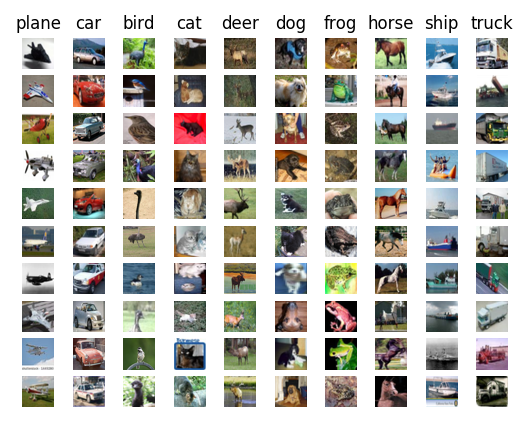

## 3. Repository Layout
- `excercise/part-5/notebooks/`: Analysis notebooks, data extraction scripts, visualization pipelines
- `excercise/part-5/report/`: Final report (`LSTM_CIFAR10_Report.tex`) and generated figures
- `excercise/part-5/out.json`: Explored output data from experiment logging

## 4. Reproducibility Instructions
### Environment
- Python >= 3.8
- PyTorch (with CUDA recommended)
- torchvision
- NumPy, Matplotlib, Seaborn, Pandas, Scikit-learn

### Execution steps
1. Launch the notebook:
   - Open `excercise/part-5/notebooks/gru-cifar10-patch-sequence.ipynb` for end-to-end procedure

2. Train models (if script available in your environment):
   - `python train.py` (or equivalent script in notebook code)
   - Ensure `torchvision.datasets.CIFAR10` is used for train/test splits

3. Generate experimental figures:
   - Loss/accuracy curves saved under `images/*.png`
   - Confusion matrices and attention maps saved under `images/*.png`

### Recommended parameters
- `batch_size=128`
- `epochs=50`
- `learning_rate=0.001`
- `weight_decay=1e-4`
- `num_workers=2`
- `hidden_size=128`
- `num_layers=2`
- `bidirectional=True`
- `dropout=0.3`
- Early stopping patience: 7 epochs

## 5. Methodological Summary
### Sequence conversion
- Row-wise: image reshape from (C, H, W) to (H, W, C), sequence length T=32, feature dim D=96
- Column-wise: reshape to (W, H, C), same T=32, D=96
- Patch-wise: non-overlapping 4x4 patches, T=64, D=48

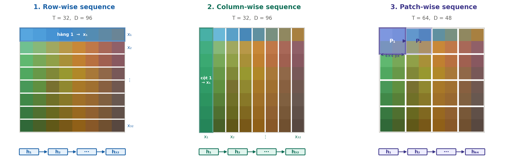

### Model topology
- Dual-layer Bi-directional LSTM/GRU + attention + final classification head
- Output layer: Linear -> Softmax over 10 classes
- Loss: CrossEntropy
- Optimizer: Adam
- LR scheduler: ReduceLROnPlateau (validation accuracy)
- Checkpoint strategy: save best model with highest val accuracy

## 6. Key Results (from report)
| Model | Representation | Accuracy | Parameter Count | Epoch Time |
|------|---------------|----------|-----------------|------------|
| LSTM | Column-wise | 62.23% | 694,603 | ~15.2s |
| LSTM | Row-wise | 68.60% | 694,603 | ~15.5s |
| LSTM | Patch-wise | 79.28% | 741,899 | ~16.8s |
| GRU | Patch-wise | 79.87% | 511,883 | ~11.9s |

### Training curves
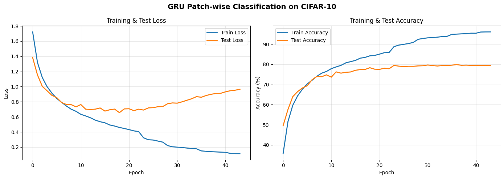

### Confusion matrices
- Row-wise: 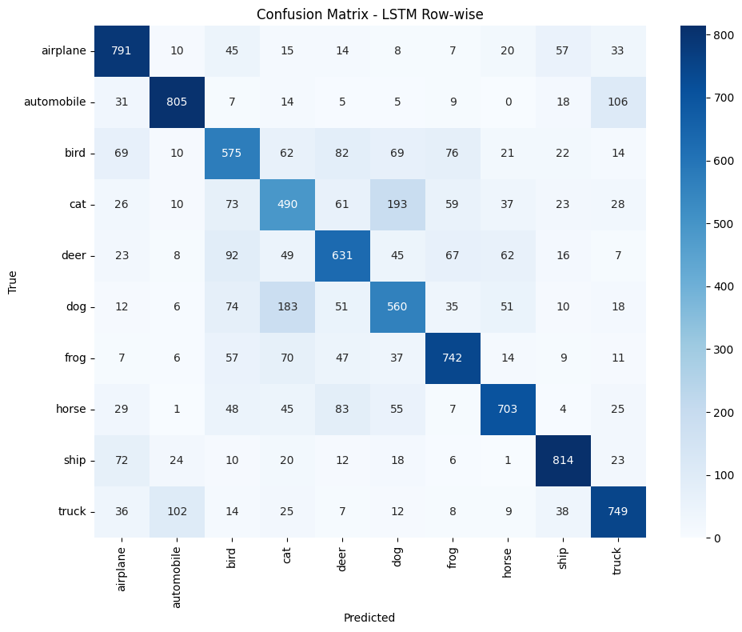
- Column-wise: 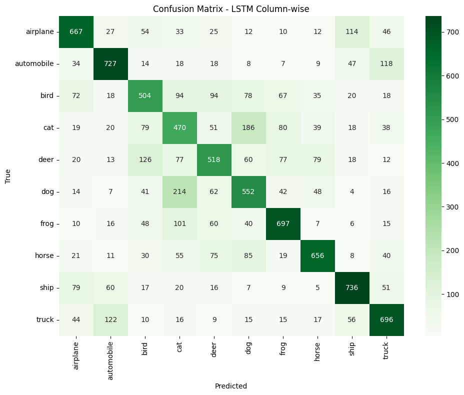
- Patch-wise: 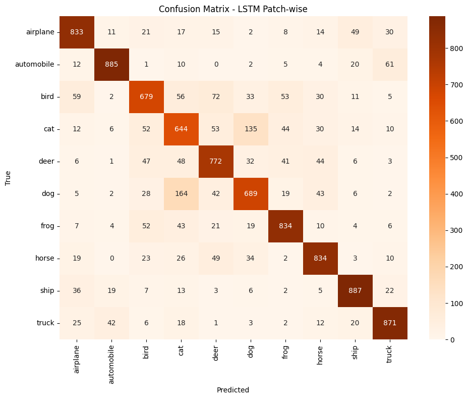
- GRU: 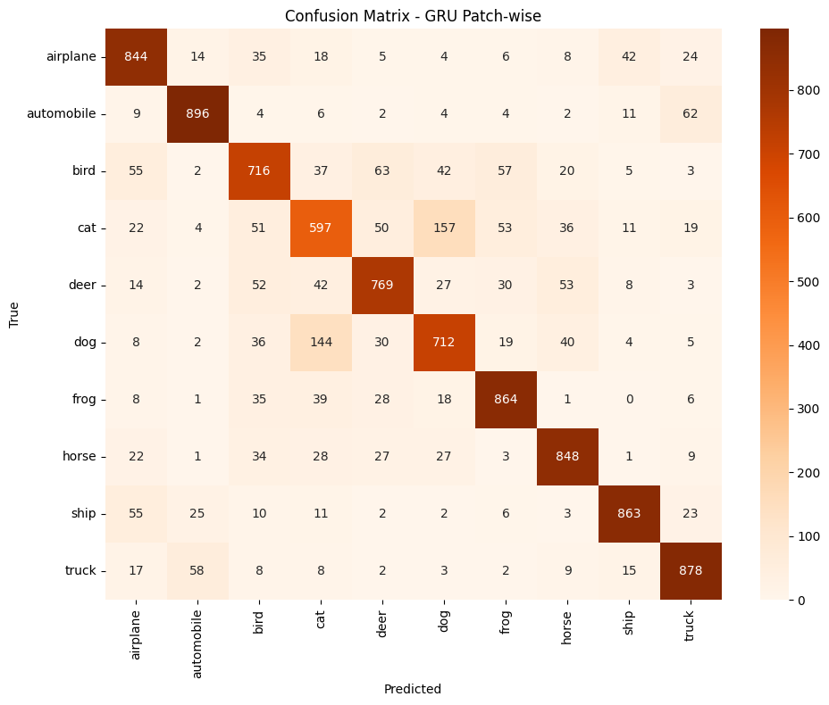

### Attention heatmaps
- Row-wise: 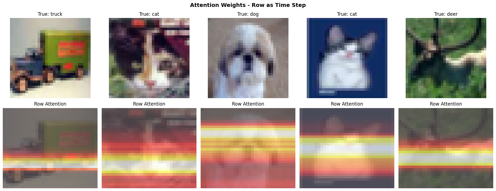
- Column-wise: 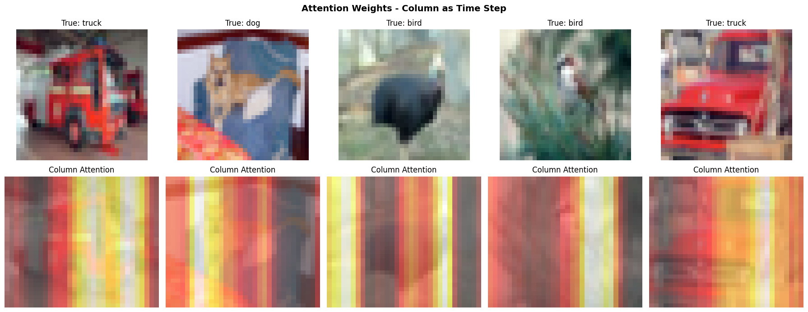
- Patch-wise: 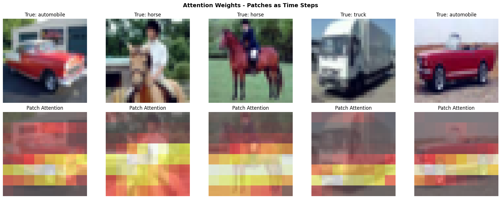
- GRU: 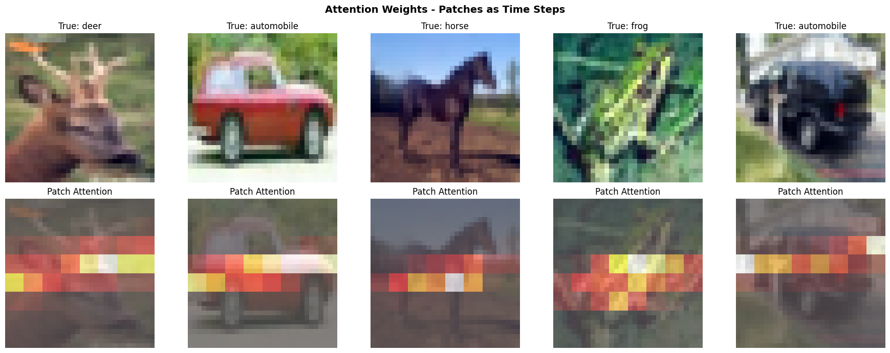
